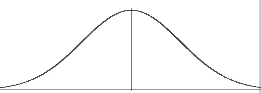

# azure-caches

Example Cache implementations in Azure - Redis, CosmosDB, etc

## CosmosDB

### Overview 


### Latency Bell Curve



### Partition Keys and Logical and Physical Partitions


### Skewed vs Unskewed Partition Keys


### Indexing

Default policy:
```
{
    "indexingMode": "consistent",
    "automatic": true,
    "includedPaths": [
        {
            "path": "/*"
        }
    ],
    "excludedPaths": [
        {
            "path": "/\"_etag\"/?"
        }
    ]
}
```

---

## Provisioning - Azure CosmosDB/SQL and Azure Redis Cache

### Using Azure Portal

- Create a Resource Group (RG)
- Create an Azure Redis Cache within the RG.  Standard SKU, c1 VM size.
- Create a CosmosDB/SQL account within the RG.
  - Database: dev, Container: cache with partition key /pk

### Using the az CLI

- Edit file **automation/env.sh**; name the resource groups and resources as necessary
- Execute the following scripts; functionally equivalent to the above Azure Portal instructions.
```
$ cd automation
$ ./redis.sh create
$ ./cosmos_sql.sh
```

These instructions are for Linux or macOS, but the az commands are identical on Windows.

---

## The Performance Test

On an Ubuntu Linux VM in Azure, in same region as Azure Redis and Azure CosmosDB, 
using a Python 3 client program (main.py)

### Load CosmosDB and Redis with the same keys and data

Executed this locally on dev laptop:

```
$ python main.py populate_cosmos_npm      > data/results/populate_cosmos_npm.txt
$ python main.py populate_cosmos_zipcodes > data/results/populate_cosmos_zipcodes.txt
$ python main.py populate_redis_npm       > data/results/populate_redis_npm.txt
$ python main.py populate_redis_zipcodes  > data/results/populate_redis_zipcodes.txt
```

### Redis (in-memory) vs CosmosDB (distributed)

Executed this on an Azure Linux VM in the same region as CosmosDB and Redis:

```
(azure-caches) cjoakim@cjoakimuvm1:~/azure-caches$ python main.py perf_test_cosmos > data/results/perf_test_cosmos.txt
(azure-caches) cjoakim@cjoakimuvm1:~/azure-caches$ python main.py perf_test_redis  > data/results/perf_test_redis.txt
(azure-caches) cjoakim@cjoakimuvm1:~/azure-caches$ python main.py produce_report
doc count:    1714
doc avg size: 2158
sum_cosmos:   12.664503335952759
sum_redis:    3.4096603393554688
avg_cosmos:   0.007388858422376172
avg_redis:    0.001989300081304241
file written: data/results/results.csv
```
