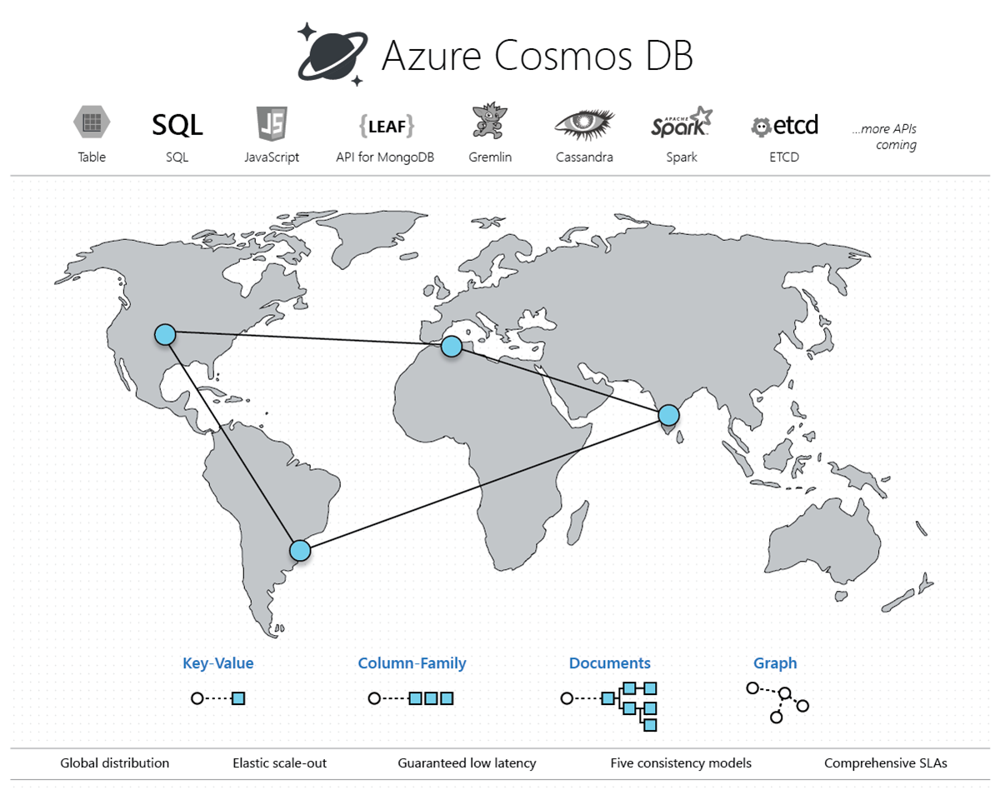

# azure-caches

Example Cache implementations in Azure - Redis, CosmosDB, etc

## CosmosDB

### Overview 

<p align="center">
  
</p>

### Links

- https://docs.microsoft.com/en-us/azure/cosmos-db/

---

### Availability SLA

99.99% single region-deployment, 99.999% multi-region deployment

### Latency SLA

<p align="center">
  
</p>

- 99th percentile 1RU reads within 10ms
- https://azure.microsoft.com/en-us/support/legal/sla/cosmos-db/v1_3/

---

### Partition Keys -> Logical and Physical Partitions

<p align="center">
  
</p>

---

### Skewed vs Unskewed Partition Keys

<p align="center">
  
</p>

---

### Indexing

Default policy:
```
{
    "indexingMode": "consistent",
    "automatic": true,
    "includedPaths": [
        {
            "path": "/*"
        }
    ],
    "excludedPaths": [
        {
            "path": "/\"_etag\"/?"
        }
    ]
}
```

Potential policy for a Cache collection:
```
  {
      "indexingMode": "consistent",
      "includedPaths": [
          {
              "path": "/path/to/something/queried/*"
          },
          {
              "path": "/path/to/something/else/queried/*"
          }
      ],
      "excludedPaths": [
          {
              "path": "/*"
          }
      ]
  }
```

Comparison to MongoDB explicit indexing:
```
db.account_info.drop()
db.createCollection("account_info")
db.account_info.ensureIndex({"acct_id" : 1}, {"unique" : false})
db.account_info.ensureIndex({"login_id" : 1}, {"unique" : false})
db.account_info.ensureIndex({"unique_key" : 1}, {"unique" : true})
```

---

## Provisioning - Azure CosmosDB/SQL and Azure Redis Cache

### Using Azure Portal

- Create a Resource Group (RG)
- Create an Azure Redis Cache within the RG.  Standard SKU, c1 VM size.
- Create a CosmosDB/SQL account within the RG.
  - Database: dev, Container: cache with partition key /pk

### Using the az CLI

- Edit file **automation/env.sh**; name the resource groups and resources as necessary
- Execute the following scripts; functionally equivalent to the above Azure Portal instructions.
```
$ cd automation
$ ./redis.sh create
$ ./cosmos_sql.sh
```

These instructions are for Linux or macOS, but the az commands are identical on Windows.

---

## The Performance Test

On an Ubuntu Linux VM in Azure, in same region as Azure Redis and Azure CosmosDB, 
using a Python 3 client program (main.py)

### Load CosmosDB and Redis with the same keys and data

Executed this locally on dev laptop:

```
$ python main.py populate_cosmos_npm      > data/results/populate_cosmos_npm.txt
$ python main.py populate_cosmos_zipcodes > data/results/populate_cosmos_zipcodes.txt
$ python main.py populate_redis_npm       > data/results/populate_redis_npm.txt
$ python main.py populate_redis_zipcodes  > data/results/populate_redis_zipcodes.txt
```

Sample North Carolina Zipcode Data (note the GeoJSON location attrubute):
```
{
  "location": {
    "type": "Point",
    "coordinates": [
      -80.797854,
      35.483306
    ]
  },
  "postal_cd": "28036",
  "country_cd": "US",
  "city_name": "Davidson",
  "state_abbrv": "NC",
  "latitude": 35.483306,
  "longitude": -80.797854
}
```

Sample Node.js NPM Library Data:
```
{
  "name": "m26-js",
  "description": "A Node.js library for speed and pace calculations for sports like running and cycling. Age-graded times and heart-rate training-zones are also supported.",
  "dist-tags": {
    "latest": "0.4.0"
  },
  "versions": [
    "0.0.1",
    "0.0.2",
    "0.0.3",
    "0.1.0",
    "0.1.1",
    "0.1.2",
    "0.1.3",
    "0.1.4",
    "0.1.5",
    "0.2.0",
    "0.3.0",
    "0.3.1",
    "0.3.2",
    "0.4.0"
  ],
  "maintainers": [
    "cjoakim <christopher.joakim@gmail.com>"
  ],
  "time": {
    "modified": "2015-08-04T20:09:21.269Z",
    "created": "2014-11-01T13:26:29.208Z",
    "0.0.1": "2014-11-01T13:26:29.208Z",
    "0.0.2": "2014-11-01T13:52:59.898Z",
    "0.0.3": "2014-11-01T15:37:18.471Z",
    "0.1.0": "2014-11-01T15:45:53.560Z",
    "0.1.1": "2014-11-01T21:18:14.382Z",
    "0.1.2": "2014-11-01T22:18:37.600Z",
    "0.1.3": "2014-11-02T11:30:34.346Z",
    "0.1.4": "2014-11-05T22:17:36.534Z",
    "0.1.5": "2014-11-06T11:21:27.723Z",
    "0.2.0": "2014-11-09T18:11:37.202Z",
    "0.3.0": "2015-05-12T11:16:19.003Z",
    "0.3.1": "2015-05-12T11:55:36.561Z",
    "0.3.2": "2015-05-13T09:29:45.643Z",
    "0.4.0": "2015-08-04T20:09:21.269Z"
  },
  "homepage": "https://github.com/cjoakim/m26-js",
  "keywords": [
    "m26",
    "running",
    "cycling",
    "swimming",
    "calculations",
    "heart",
    "rate",
    "zone",
    "age",
    "graded"
  ],
  "repository": {
    "type": "git",
    "url": "git+https://github.com/cjoakim/m26-js.git"
  },
  "author": "Christopher Joakim (http://www.chrisjoakim.com)",
  "bugs": {
    "url": "https://github.com/cjoakim/m26-js/issues"
  },
  "readmeFilename": "README.md",
  "users": {
    "cjoakim": true
  },
  "version": "0.4.0",
  "main": "lib/m26.js",
  "licenses": [
    {
      "type": "ISC",
      "url": "https://github.com/cjoakim/m26-js/blob/master/LICENSE"
    }
  ],
  "dependencies": {},
  "devDependencies": {
    "grunt": "~0.4.5",
    "grunt-contrib-coffee": "~0.13.0",
    "grunt-contrib-jasmine": "~0.9.0"
  },
  "scripts": {
    "test": "grunt jasmine"
  },
  "dist": {
    "shasum": "7c37e676b4d1314d4579a033ed3d5f895b02aa2a",
    "tarball": "https://registry.npmjs.org/m26-js/-/m26-js-0.4.0.tgz"
  },
  "directories": {}
}
```

### Query CosmosDB

```
SELECT * FROM c where c.pk = '28036'

SELECT c.postal_cd, c.city_name FROM c WHERE ST_DISTANCE(
  c.location, {'type': 'Point', 'coordinates':[ -78.791111, 35.878425 ]}) < 30000
```

35.878425, -78.791111

### Redis (in-memory) vs CosmosDB (distributed)

Executed this on an Azure Linux VM in the same region as CosmosDB and Redis:

```
(azure-caches) cjoakim@cjoakimuvm1:~/azure-caches$ python main.py perf_test_cosmos > data/results/perf_test_cosmos.txt
(azure-caches) cjoakim@cjoakimuvm1:~/azure-caches$ python main.py perf_test_redis  > data/results/perf_test_redis.txt
(azure-caches) cjoakim@cjoakimuvm1:~/azure-caches$ python main.py produce_report
doc count:    1714
doc avg size: 2158
sum_cosmos:   12.664503335952759
sum_redis:    3.4096603393554688
avg_cosmos:   0.007388858422376172
avg_redis:    0.001989300081304241
file written: data/results/results.csv
```
